# 微服务

​	微服务是一种架构设计，在软件发展初期，往往一个单体项目就可使用，但是随着用户以及规模的发展，服务越来越多，单体的承受能力不够，就设计出一种专注于单一业务的模式，很多专注于单一业务的集群就是微服务架构。

​	单体项目发展成微服务项目，就会出现很多问题，比如说服务之间的调用，前端调用后端的接口，事务的一致性等等。


# Mybatis -Plus

[MyBatis-Plus](https://github.com/baomidou/mybatis-plus) 是一个 [MyBatis](https://www.mybatis.org/mybatis-3/) 的增强工具，在 MyBatis 的基础上只做增强不做改变，为简化开发、提高效率而生。

+ **无侵入**：只做增强不做改变，引入它不会对现有工程产生影响，如丝般顺滑
+ **损耗小**：启动即会自动注入基本 CURD，性能基本无损耗，直接面向对象操作
+ **强大的 CRUD 操作**：内置通用 Mapper、通用 Service，仅仅通过少量配置即可实现单表大部分 CRUD 操作，更有强大的条件构造器，满足各类使用需求
+ **支持 Lambda 形式调用**：通过 Lambda 表达式，方便的编写各类查询条件，无需再担心字段写错
+ **支持主键自动生成**：支持多达 4 种主键策略（内含分布式唯一 ID 生成器 - Sequence），可自由配置，完美解决主键问题
+ **支持 ActiveRecord 模式**：支持 ActiveRecord 形式调用，实体类只需继承 Model 类即可进行强大的 CRUD 操作
+ **支持自定义全局通用操作**：支持全局通用方法注入（ Write once, use anywhere ）
+ **内置代码生成器**：采用代码或者 Maven 插件可快速生成 Mapper 、 Model 、 Service 、 Controller 层代码，支持模板引擎，更有超多自定义配置等您来使用
+ **内置分页插件**：基于 MyBatis 物理分页，开发者无需关心具体操作，配置好插件之后，写分页等同于普通 List 查询
+ **分页插件支持多种数据库**：支持 MySQL、MariaDB、Oracle、DB2、H2、HSQL、SQLite、Postgre、SQLServer 等多种数据库
+ **内置性能分析插件**：可输出 SQL 语句以及其执行时间，建议开发测试时启用该功能，能快速揪出慢查询
+ **内置全局拦截插件**：提供全表 delete 、 update 操作智能分析阻断，也可自定义拦截规则，预防误操作


## 1.快速入门

1. 引入依赖

```pom
        <dependency>
            <groupId>com.baomidou</groupId>
            <artifactId>mybatis-plus-boot-starter</artifactId>
            <version>3.5.9</version>
        </dependency>
```

引入 `MyBatis-Plus` 之后请不要再次引入 `MyBatis` 以及 `mybatis-spring-boot-starter`和`MyBatis-Spring`，以避免因版本差异导致的问题。

自**3.5.4**开始，在没有使用`mybatis-plus-boot-starter`或`mybatis-plus-spring-boot3-starter`情况下，请自行根据项目情况引入`mybatis-spring`。

2. 继承方法

```java
public interface UserMapper extends BaseMapper<User> {

}
```

3. 测试方法


### 常用注解

MybatisPlus通过扫描实体类，并基于反射获取实体类的信息作为数据库表信息.

```java
public interface UserInfoMapper extends BaseMapper<UserInfo> {

}
```

```java
@MapperScan("com.ls.mp.mapper")
@SpringBootApplication
public class MPApplication {
    public static void main(String[] args) {
        SpringApplication.run(MPApplication.class, args);
    }
}
```

MybatisPlus就是根据PO实体的信息来推断出表的信息，从而生成SQL的。默认情况下：

+ MybatisPlus会把PO实体的类名驼峰转下划线作为表名
+ MybatisPlus会把PO实体的所有变量名驼峰转下划线作为表的字段名，并根据变量类型推断字段类型
+ MybatisPlus会把名为id的字段作为主键

但很多情况下，默认的实现与实际场景不符，因此MybatisPlus提供了一些注解便于我们声明表信息。

@TableName:指定数据库表明

@TableId：指定主键信息

@TableField:指定不同字段的信息

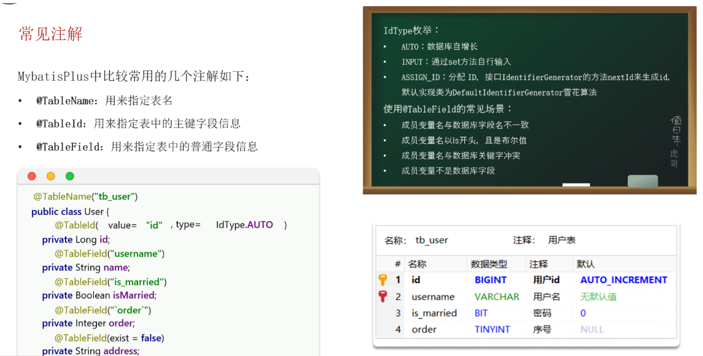

[注解配置 | MyBatis-Plus](https://baomidou.com/reference/annotation/)

总结

MybatisPlus 是如何获取实现CRUD的数据库表信息的呢？

它默认以类名的驼峰命名方式转换为下划线命名作为表名，默认把名为id的字段作为主键，同时默认把类的成员变量名以驼峰命名方式转换为下划线命名作为表的字段名。

MybatisPlus的常用注解有哪些呢？主要有以下几个：

+ `@TableName`：用于指定表名称及进行全局配置。
+ `@TableId`：用于指定id字段及相关配置。
+ `@TableField`：用于指定普通字段及相关配置。

接下来，ldType（这里可能是指主键生成策略的类型）的常见类型有哪些呢？主要有：

+ AUTO：自动增长策略。
+ ASSIGN_ID：分配ID策略。
+ INPUT：手动输入策略。

使用`@TableField`的常见场景是什么呢？主要包括以下几种情况：

+ 当成员变量名与数据库字段名不一致时。
+ 当成员变量名以is开头，且是布尔值时（通常用于判断类型的字段）。
+ 当成员变量名与数据库关键字冲突时。
+ 当成员变量不是数据库字段时（即该变量不需要映射到数据库表中）。

### 常用配置

```yaml

mybatis-plus:
  mapper-locations: classpath*:mapper/*.xml  # mapper文件位置 默认值
  type-aliases-package: com.ls.mp.pojo   # 别名扫描包
  configuration:
    map-underscore-to-camel-case: true # 驼峰命名 默认开启
    cache-enabled: false  # 二级缓存  默认不开启
  global-config:
    db-config:
      id-type: assign_id # 全局配置主键生成策略 默认值
      update-strategy: not_null # 全局配置更新策略 只更新非空字段

```


在引入了mp之后，mybatis的就不生效了因为我们引入的时mp的依赖。但是mp继承了mybatis的依赖

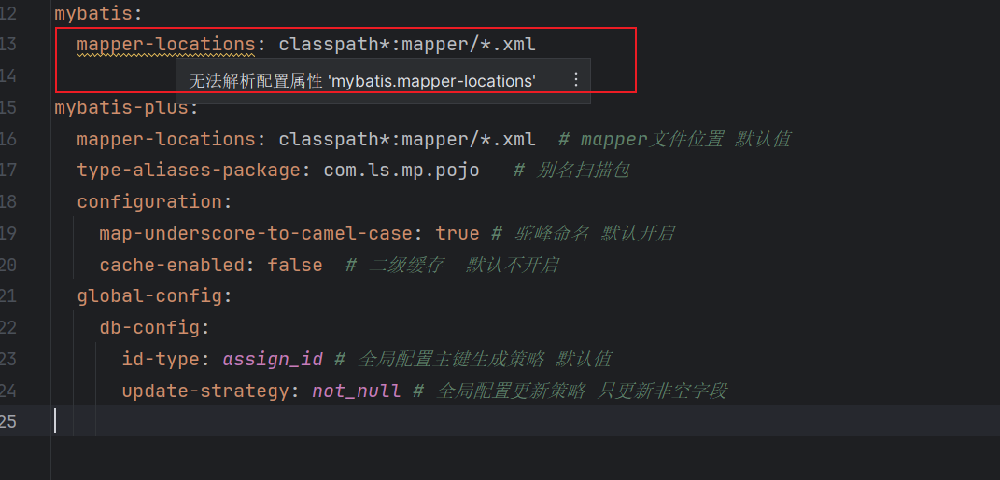

## 2.核心功能

内置通用 BaseMapper、通用 IService

### 条件构造器

BaseMapper的方法，的参数Wrapper就是条件构造器。

那么这个条件构造器是什么？又怎么拿到这个条件构造器呢？


Weapper接口以及实现类

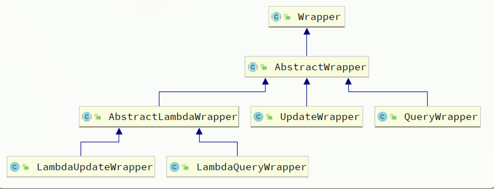

AbStractWrapper的方法很多，主要是用户构造查询条件Where

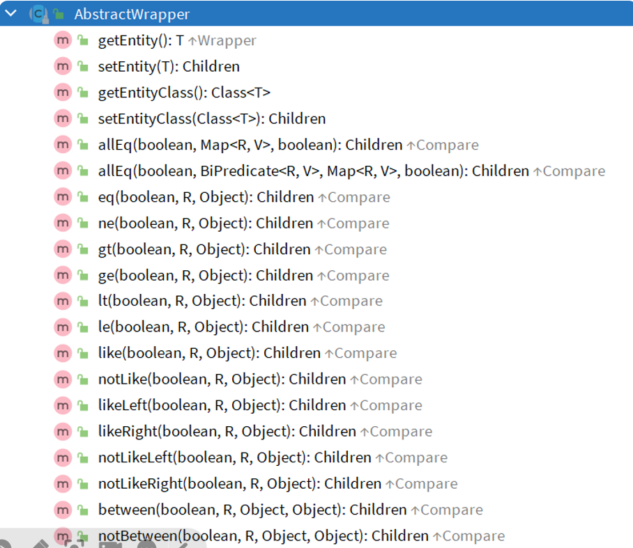

QueryWrapper继承了AbstractWrapper，此外还扩展了一下方法，主要是用户查询指定的字段


updateWrapper扩展了更新字段的方法

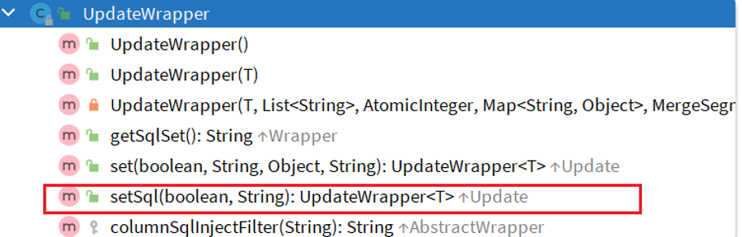


### QuetryWrapper

无论是修改、删除、查询，都可以使用QueryWrapper来构建查询条件。接下来看一些例子：

 **查询**：查询出名字中带`o`的，存款大于等于1000元的人。代码如下：

```java
@Test
void testQueryWrapper() {
    // 1.构建查询条件 where name like "%o%" AND balance >= 1000
    QueryWrapper<User> wrapper = new QueryWrapper<User>()
            .select("id", "username", "info", "balance")
            .like("username", "o")
            .ge("balance", 1000);
    // 2.查询数据
    List<User> users = userMapper.selectList(wrapper);
    users.forEach(System.out::println);
}
```

**更新**：更新用户名为jack的用户的余额为2000，代码如下：

```java
@Test
void testUpdateByQueryWrapper() {
    // 1.构建查询条件 where name = "Jack"
    QueryWrapper<User> wrapper = new QueryWrapper<User>().eq("username", "Jack");
    // 2.更新数据，user中非null字段都会作为set语句
    User user = new User();
    user.setBalance(2000);
    userMapper.update(user, wrapper);
}
```

### **UpdateWrapper**

基于BaseMapper中的update方法更新时只能直接赋值，对于一些复杂的需求就难以实现。 例如：更新id为`1,2,4`的用户的余额，扣200，对应的SQL应该是：

```sql
UPDATE user SET balance = balance - 200 WHERE id in (1, 2, 4)
```

SET的赋值结果是基于字段现有值的，这个时候就要利用UpdateWrapper中的setSql功能了：

```Java
@Test
void testUpdateWrapper() {
    List<Long> ids = List.of(1L, 2L, 4L);
    // 1.生成SQL
    UpdateWrapper<User> wrapper = new UpdateWrapper<User>()
            .setSql("balance = balance - 200") // SET balance = balance - 200
            .in("id", ids); // WHERE id in (1, 2, 4)
        // 2.更新，注意第一个参数可以给null，也就是不填更新字段和数据，
    // 而是基于UpdateWrapper中的setSQL来更新
    userMapper.update(null, wrapper);
}
```

### LambdaQueryWrapper

无论是QueryWrapper还是UpdateWrapper在构造条件的时候都需要写死字段名称，会出现字符串`魔法值`。这在编程规范中显然是不推荐的。 那怎么样才能不写字段名，又能知道字段名呢？

其中一种办法是基于变量的`gettter`方法结合反射技术。因此我们只要将条件对应的字段的`getter`方法传递给MybatisPlus，它就能计算出对应的变量名了。而传递方法可以使用JDK8中的`方法引用`和`Lambda`表达式。 因此MybatisPlus又提供了一套基于Lambda的Wrapper，包含两个：

+ LambdaQueryWrapper
+ LambdaUpdateWrapper

分别对应QueryWrapper和UpdateWrapper

```Java
@Test
void testLambdaQueryWrapper() {
    // 1.构建条件 WHERE username LIKE "%o%" AND balance >= 1000
    QueryWrapper<User> wrapper = new QueryWrapper<>();
    wrapper.lambda()
            .select(User::getId, User::getUsername, User::getInfo, User::getBalance)
            .like(User::getUsername, "o")
            .ge(User::getBalance, 1000);
    // 2.查询
    List<User> users = userMapper.selectList(wrapper);
    users.forEach(System.out::println);
}
```


### 自定义Sql

上述代码中，有些特殊的查询或者更新，需要拼接sql语句

其实有点不规范，在业务层写sql有些企业是不允许的，我们可以自定义sql。


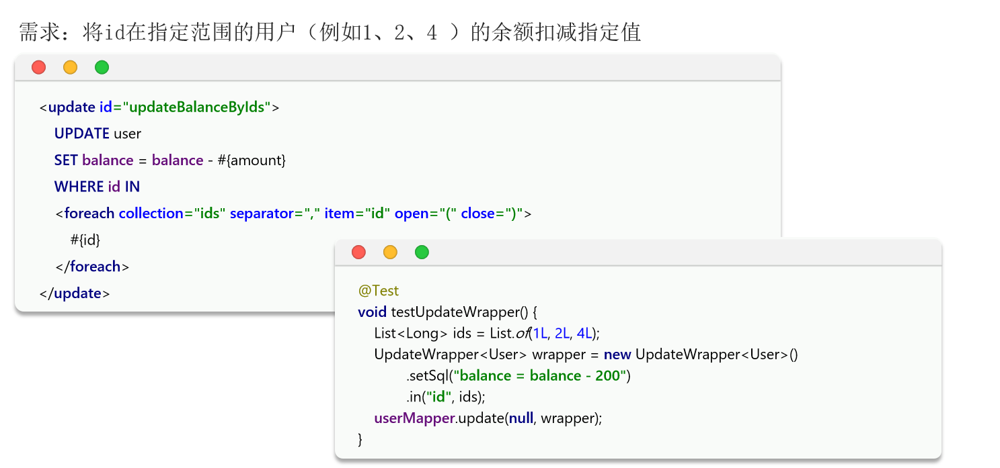

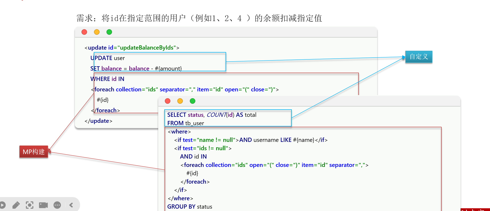


上述中mp很简单的构造查询条件。

>  我们可以利用MyBatisPlus的Wrapper来构建复杂的Where条件，然后自己定义SQL语句中剩下的部分。

就是只使用mp构造查询条件，查询条件作为参数传给我们自定义sql


1. 构造wrapper，自定义方法

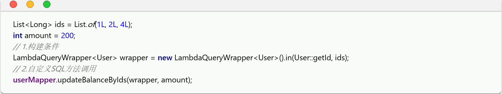

在mapper方法中接收参数，wrapper变量名称必须是ew


自定义sql并使用wrapper条件


### 通用BaseMapper

### 通用Iservice

Iservice接口

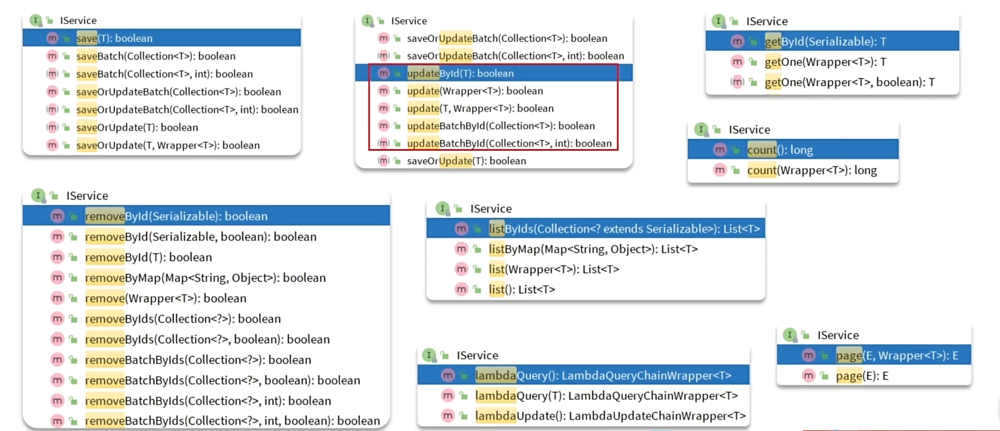

Iservice 的使用

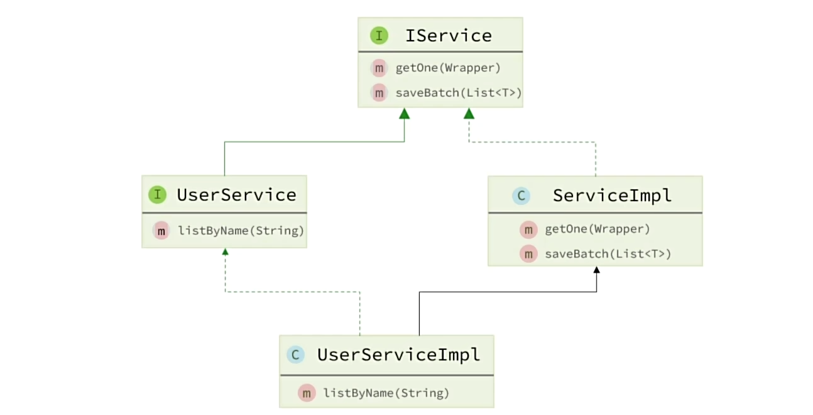

```java
public interface UserService extends IService<User> {
}
```

```java
public class UserServiceImpl  extends ServiceImpl<UserMapper, User> implements UserService {

}
```

### 练习实现下面的接口


| **编号** | **接口**       | **请求方式** | **请求路径** | **请求参数** | **返回值** |
| :------- | :------------- | :----------- | :----------- | :----------- | :--------- |
| 1        | 新增用户       | POST         | /users       | 用户表单实体 | 无         |
| 2        | 删除用户       | DELETE       | /users/{id}  | 用户id       | 无         |
| 3        | 根据id查询用户 | GET          | /users/{id}  | 用户id       | 用户VO     |
| 4        | 根据id批量查询 | GET          | /users       | 用户id集合   | 用户VO集合 |

引入依赖

```xml
<!--swagger-->
<dependency>
    <groupId>com.github.xiaoymin</groupId>
    <artifactId>knife4j-openapi2-spring-boot-starter</artifactId>
    <version>4.1.0</version>
</dependency>
<!--web-->
<dependency>
    <groupId>org.springframework.boot</groupId>
    <artifactId>spring-boot-starter-web</artifactId>
</dependency>
```

配置swagger

```yaml
knife4j:
  enable: true
  openapi:
    title: 用户管理接口文档
    description: "用户管理接口文档"
    email:
    concat: hnsqls
    url: 
    version: v1.0.0
    group:
      default:
        group-name: default
        api-rule: package
        api-rule-resources:
          - com.ls.mp.controller
```

准备dto vo

```java
@ApiModel("用户DTO")
@Data
public class UserDTO {
    @ApiModelProperty("id")
    private Long id;

    @ApiModelProperty("用户名")
    private String username;

    @ApiModelProperty("密码")
    private String password;

    @ApiModelProperty("注册手机号")
    private String phone;

    @ApiModelProperty("详细信息，JSON风格")
    private String info;

    @ApiModelProperty("账户余额")
    private Integer balance;
}

```

```java
@ApiModel(description = "用户VO信息")
@Data
public class UserVo {
    @ApiModelProperty("用户id")
    private Long id;

    @ApiModelProperty("用户名")
    private String username;

    @ApiModelProperty("详细信息")
    private String info;

    @ApiModelProperty("使用状态（1正常 2冻结）")
    private Integer status;

    @ApiModelProperty("账户余额")
    private Integer balance;


}

```

接口

```java
@Api("用户管理接口")
@RequestMapping(value = "/users")
@RestController
@RequiredArgsConstructor
public class UserController {


    private final UserService  userService;
    /**
     * 新增用户
     */
    @ApiOperation("新增用户")
    @PostMapping
    public void addUser(@RequestBody UserDTO userDTO) {
        //dto -> po
        User user = BeanUtil.copyProperties(userDTO, User.class);
        userService.save(user);
    }

    @ApiOperation("删除用户")
    @DeleteMapping("/{id}")
    public void deleteUser(@PathVariable Long id) {
        //dto -> po
        userService.removeById(id);

    }

    @ApiOperation("根据id查询用户")
    @GetMapping("/{id}")
    public UserVo getUserById(@PathVariable("id") Long id) {

        User user = userService.getById(id);
        // user - use vo

        return  BeanUtil.copyProperties(user, UserVo.class);

    }

    @ApiOperation("根据ids查询用户")
    @GetMapping()
    public List<UserVo> getUserByIds(@RequestParam("ids") List<Long> ids) {

        List<User> users = userService.listByIds(ids);
//        List<UserVo> list = new ArrayList<>();
//        // user - use vo
//        for (User user : users) {
//            UserVo userVo = BeanUtil.copyProperties(user, UserVo.class);
//            list.add(userVo);
//        }
//
//        return list;

        return  BeanUtil.copyToList(users, UserVo.class);

    }

    @ApiOperation("根据id扣减金额")
    @PutMapping("/{id}/deduction/{money}")
    public void deductionMoneyUserById(@PathVariable("id") Long id, @PathVariable("money") Integer money) {
        userService.deductionMoneyUserById(id, money);
    }
}
```

### **批量新增**

IService中的批量新增功能使用起来非常方便，但有一点注意事项，我们先来测试一下。 首先我们测试逐条插入数据：

```java
@SpringBootTest
class UserControllerTest {
    @Autowired
    private  UserService userService;
    @Test
    void testSaveOneByOne() {
        long b = System.currentTimeMillis();
        for (int i = 1; i <= 100000; i++) {
            userService.save(buildUser(i));
        }
        long e = System.currentTimeMillis();
        System.out.println("耗时：" + (e - b));
    }

    private User buildUser(int i) {
        User user = new User();
        user.setUsername("user_" + i);
        user.setPassword("123");
        user.setPhone("" + (18688190000L + i));
        user.setBalance(2000);
        user.setInfo("{\"age\": 24, \"intro\": \"英文老师\", \"gender\": \"female\"}");
        user.setCreateTime(LocalDateTime.now());
        user.setUpdateTime(user.getCreateTime());
        return user;
    }

}
```

插入10w条数据


用批处理

```java
@SpringBootTest
class UserControllerTest {
    @Autowired
    private  UserService userService;
    @Test
    void testSaveOneByOne() {
        long b = System.currentTimeMillis();
        for (int i = 1; i <= 100000; i++) {
            userService.save(buildUser(i));
        }
        long e = System.currentTimeMillis();
        System.out.println("耗时：" + (e - b));
    }

    private User buildUser(int i) {
        User user = new User();
        user.setUsername("user_" + i);
        user.setPassword("123");
        user.setPhone("" + (18688190000L + i));
        user.setBalance(2000);
        user.setInfo("{\"age\": 24, \"intro\": \"英文老师\", \"gender\": \"female\"}");
        user.setCreateTime(LocalDateTime.now());
        user.setUpdateTime(user.getCreateTime());
        return user;
    }

    @Test
    void testSaveBatch() {
        long b = System.currentTimeMillis();
        List<User> list = new ArrayList<>(1000);
        for (int i = 1; i <= 100000; i++) {
                list.add(buildUser(i));
                if (i % 1000 == 0) {
                    userService.saveBatch(list);
                    list.clear();
                }
        }
        long e = System.currentTimeMillis();
        System.out.println("耗时：" + (e - b));
    }
}
```

执行


可以看到使用了批处理以后，比逐条新增效率提高了10倍左右，性能还是不错的。

不过，我们简单查看一下`MybatisPlus`源码：

```Java
@Transactional(rollbackFor = Exception.class)
@Override
public boolean saveBatch(Collection<T> entityList, int batchSize) {
    String sqlStatement = getSqlStatement(SqlMethod.INSERT_ONE);
    return executeBatch(entityList, batchSize, (sqlSession, entity) -> sqlSession.insert(sqlStatement, entity));
}
// ...SqlHelper
public static <E> boolean executeBatch(Class<?> entityClass, Log log, Collection<E> list, int batchSize, BiConsumer<SqlSession, E> consumer) {
    Assert.isFalse(batchSize < 1, "batchSize must not be less than one");
    return !CollectionUtils.isEmpty(list) && executeBatch(entityClass, log, sqlSession -> {
        int size = list.size();
        int idxLimit = Math.min(batchSize, size);
        int i = 1;
        for (E element : list) {
            consumer.accept(sqlSession, element);
            if (i == idxLimit) {
                sqlSession.flushStatements();
                idxLimit = Math.min(idxLimit + batchSize, size);
            }
            i++;
        }
    });
}
```

可以发现其实`MybatisPlus`的批处理是基于`PrepareStatement`的预编译模式，然后批量提交，最终在数据库执行时还是会有多条insert语句，逐条插入数据。SQL类似这样：

```SQL
Preparing: INSERT INTO user ( username, password, phone, info, balance, create_time, update_time ) VALUES ( ?, ?, ?, ?, ?, ?, ? )
Parameters: user_1, 123, 18688190001, "", 2000, 2023-07-01, 2023-07-01
Parameters: user_2, 123, 18688190002, "", 2000, 2023-07-01, 2023-07-01
Parameters: user_3, 123, 18688190003, "", 2000, 2023-07-01, 2023-07-01
```

而如果想要得到最佳性能，最好是将多条SQL合并为一条，像这样

```SQL
INSERT INTO user ( username, password, phone, info, balance, create_time, update_time )
VALUES 
(user_1, 123, 18688190001, "", 2000, 2023-07-01, 2023-07-01),
(user_2, 123, 18688190002, "", 2000, 2023-07-01, 2023-07-01),
(user_3, 123, 18688190003, "", 2000, 2023-07-01, 2023-07-01),
(user_4, 123, 18688190004, "", 2000, 2023-07-01, 2023-07-01);
```

MySQL的客户端连接参数中有这样的一个参数：`rewriteBatchedStatements`。顾名思义，就是重写批处理的`statement`语句。

这个参数的默认值是false，我们需要修改连接参数，将其配置为true

修改项目中的application.yml文件，在jdbc的url后面添加参数`&rewriteBatchedStatements=true`:

```YAML
spring:
  datasource:
    url: jdbc:mysql://127.0.0.1:3306/mp?useUnicode=true&characterEncoding=UTF-8&autoReconnect=true&serverTimezone=Asia/Shanghai&rewriteBatchedStatements=true
    driver-class-name: com.mysql.cj.jdbc.Driver
    username: root
    password: MySQL123
```

再次执行批处理


## 扩展功能

### Mybatis代码生成

在使用MybatisPlus以后，基础的`Mapper`、`Service`、`PO`代码相对固定，重复编写也比较麻烦。因此MybatisPlus官方提供了代码生成器根据数据库表结构生成`PO`、`Mapper`、`Service`等相关代码。

MybatisX插件


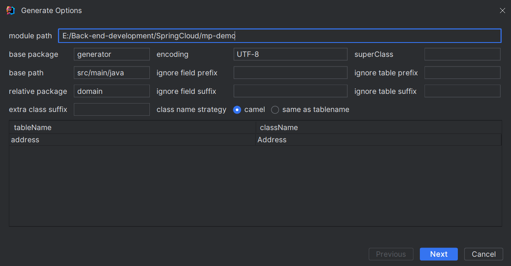

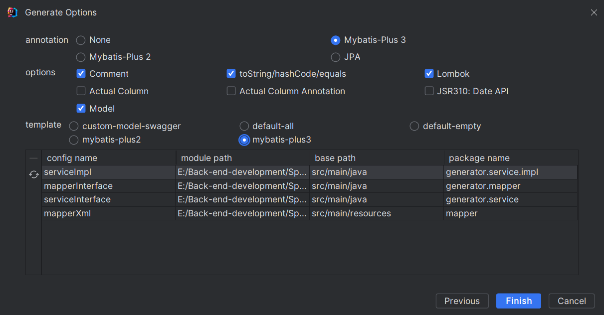

会根据数据库表生成pojo，service,serviceImpl,mapper.xml，mapper

### **静态工具**

有的时候Service之间也会相互调用，为了避免出现循环依赖问题，MybatisPlus提供一个静态工具类：`Db`，其中的一些静态方法与`IService`中方法签名基本一致，也可以帮助我们实现CRUD功能：

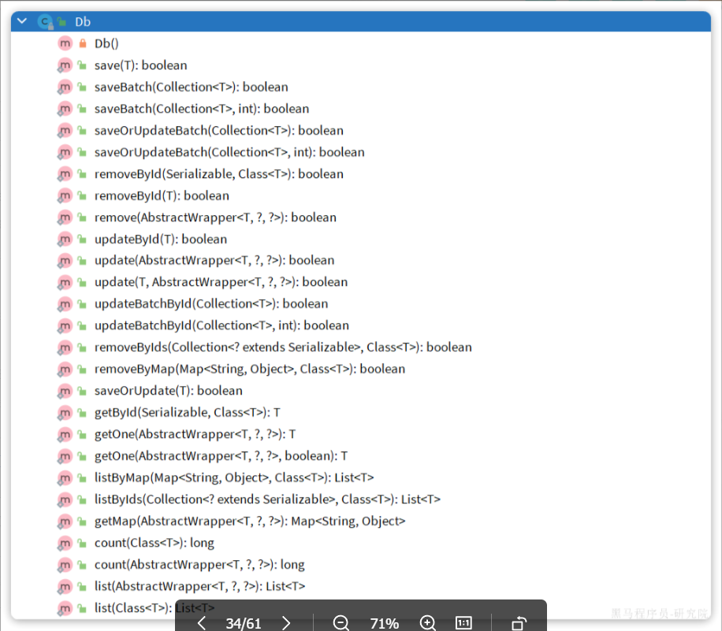

需求：改造根据id用户查询的接口，查询用户的同时返回用户收货地址列表

首先，我们要添加一个收货地址的VO对象：

```java
@Data
public class AddressVO{
    /**
     *
     * /
    private Long id;

    /**
     * 用户ID
     */
    private Long userId;

    /**
     * 省
     */
    private String province;

    /**
     * 市
     */
    private String city;

    /**
     * 县/区
     */
    private String town;

    /**
     * 手机
     */
    private String mobile;

    /**
     * 详细地址
     */
    private String street;

    /**
     * 联系人
     */
    private String contact;

    /**
     * 备注
     */
    private String notes;


    private static final long serialVersionUID = 1L;
}

```

改造uservo

```java
@ApiModel(description = "用户VO信息")
@Data
public class UserVo {
    @ApiModelProperty("用户id")
    private Long id;

    @ApiModelProperty("用户名")
    private String username;

    @ApiModelProperty("详细信息")
    private String info;

    @ApiModelProperty("使用状态（1正常 2冻结）")
    private Integer status;

    @ApiModelProperty("账户余额")
    private Integer balance;

    /**
     * 地址
     */
    private List<AddressVO> addressList;


}
```

controller

```java
    @ApiOperation("根据id查询用户-同时查询地址")
    @GetMapping("/{id}")
    public UserVo getUserById(@PathVariable("id") Long id) {

        return  userService.queryUserAndAddressById(id);

    }
```

Service

```java
  

/**
     * 根据id 查用户以及地址
     * @param id
     * @return
     */
    @Override
    public UserVo queryUserAndAddressById(Long id) {
        User user = getById(id);
        if (user == null || user.getStatus() == 2) {
            throw  new RuntimeException("用户不存在");
        }
        UserVo userVo = BeanUtil.copyProperties(user, UserVo.class);

        List<Address> list = addressService.lambdaQuery().eq(Address::getUserId, id).list();
        if (list != null || list.size() != 0) {
            userVo.setAddressList(BeanUtil.copyToList(list, AddressVO.class));
        }

        return userVo;
    }
```

注意，这里使用了addService ,也就是在userSevice中使用了addService，可以依赖注入。这样目前没有问题。但是当我们在写addressService的时候，可能也会用到UserService。

比如在根据id查地址的同时查用户信息。

修改addressVo

```java
新增   
/**
     * 用户信息
     */
    private UserVo userVO;
```

controller

```java
@RestController
@Api("地址接口")
@RequestMapping(value = "/address")
@RequiredArgsConstructor
public class AddressController {

    private final AddressService addressService;


    /**
     * 根据id查询地址和用户信息
     * @param id
     * @return
     */
    @GetMapping("/{id}")
    public AddressVO queryAddressAndUserById(@PathVariable("id") Long id) {
        return addressService.queryAddressAndUserById(id);


    }
}
```

service

```java
public interface AddressService extends IService<Address> {

    AddressVO queryAddressAndUserById(Long id);
}

```

serviceImpl

```java
@Service
@RequiredArgsConstructor
public class AddressServiceImpl extends ServiceImpl<AddressMapper, Address>
    implements AddressService{


    private final UserService userService;

    /**
     * 根据id查询地址和用户信息
     * @param id
     * @return
     */

    @Override
    public AddressVO queryAddressAndUserById(Long id) {
        Address address = getById(59);
        AddressVO addressVO = BeanUtil.copyProperties(address, AddressVO.class);

        LambdaQueryWrapper<User> queryWrapper = new LambdaQueryWrapper<>();
        queryWrapper.eq(User::getId, address.getUserId());
        User user = userService.getOne(queryWrapper);

        addressVO.setUserVO(BeanUtil.copyProperties(user, UserVo.class));

        return addressVO;
    }
}
```

启动项目发现循环依赖。

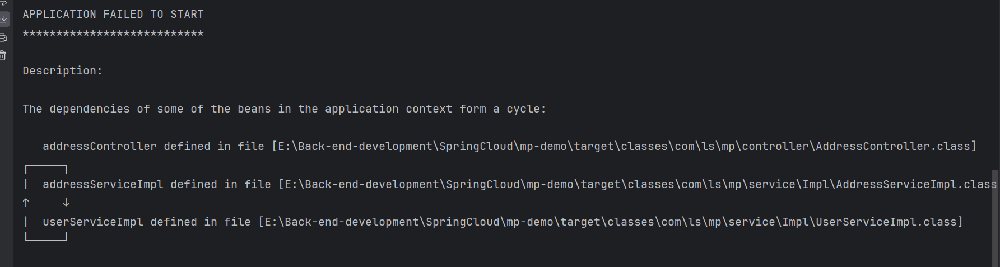

这是因为A依赖B,B又依赖A所以导致循环依赖。我们可以开启三级缓存或者@Lazy注解解决。

@Lazy注解解决 在构造函数的参数使用@Lazy

```java
   public AddressServiceImpl(@Lazy UserService userService) {
        this.userService = userService;
    }

    private final UserService userService;
```

但是还是尽量避免循环依赖问题。那我们不相互引入怎么操作?可以使用静态工具DB

controller

```java
@RestController
@Api("地址接口")
@RequestMapping(value = "/address")
@RequiredArgsConstructor
public class AddressController {

    private final AddressService addressService;


    /**
     * 根据id查询地址和用户信息
     * @param id
     * @return
     */
    @GetMapping("/{id}")
    public AddressVO queryAddressAndUserById(@PathVariable("id") Long id) {
        return addressService.queryAddressAndUserById(id);


    }
}
```

service

```java
public interface AddressService extends IService<Address> {

    AddressVO queryAddressAndUserById(Long id);
}

```

serviceImpl

```java
@Service

public class AddressServiceImpl extends ServiceImpl<AddressMapper, Address>
    implements AddressService{

    /**
     * 根据id查询地址和用户信息
     * @param id
     * @return
     */

    @Override
    public AddressVO queryAddressAndUserById(Long id) {
        Address address = getById(59);
        AddressVO addressVO = BeanUtil.copyProperties(address, AddressVO.class);

        User user = Db.lambdaQuery(User.class)
                .eq(User::getId, address.getUserId()).one();

        addressVO.setUserVO(BeanUtil.copyProperties(user, UserVo.class));

        return addressVO;
    }
}
```


### 逻辑删除

对于一些比较重要的数据，我们往往会采用逻辑删除的方案，即：

+ 在表中添加一个字段标记数据是否被删除
+ 当删除数据时把标记置为true
+ 查询时过滤掉标记为true的数据

一旦采用了逻辑删除，所有的查询和删除逻辑都要跟着变化，非常麻烦。

为了解决这个问题，MybatisPlus就添加了对逻辑删除的支持。

添加isDelete字段

```sql
alter table  address add column deleted boolean default false;
```

```xml
logic-delete-field: deleted # 全局逻辑删除字段
```

或者在字段上@Logic

### 枚举处理器

User类中有一个用户状态字段：


像这种字段我们一般会定义一个枚举，做业务判断的时候就可以直接基于枚举做比较。但是我们数据库采用的是`int`类型，对应的PO也是`Integer`。因此业务操作时必须手动把`枚举`与`Integer`转换，非常麻烦。

因此，MybatisPlus提供了一个处理枚举的类型转换器，可以帮我们**把枚举类型与数据库类型自动转换**。

创建枚举类

```java
@Getter
public enum UserEnum {
    NORMAL(1,"正常"),
    FREEZE(2,"冻结");
    private final Integer value;
    private final String desc;

    UserEnum(Integer value, String desc) {
        this.value = value;
        this.desc = desc;
    }

}
```

修改pojo

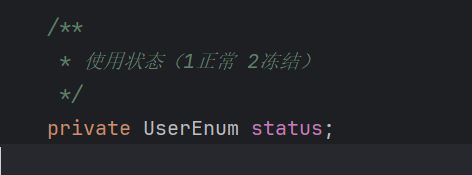

告诉mp使用那个枚举字段 @EnumValue


配置枚举处理器

```java
mybatis-plus:
  configuration:
    default-enum-type-handler: com.baomidou.mybatisplus.core.handlers.MybatisEnumTypeHandler
```

测试发现，返回状态没有映射上去，因为pojo是枚举类型，但是vo中还是int 类型匹配不上

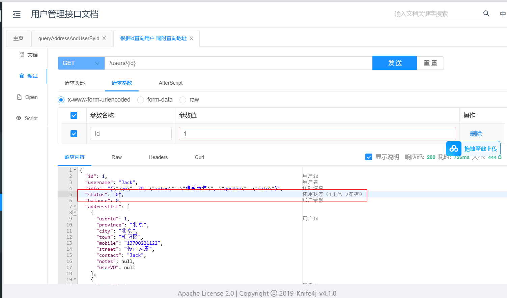

修改vo

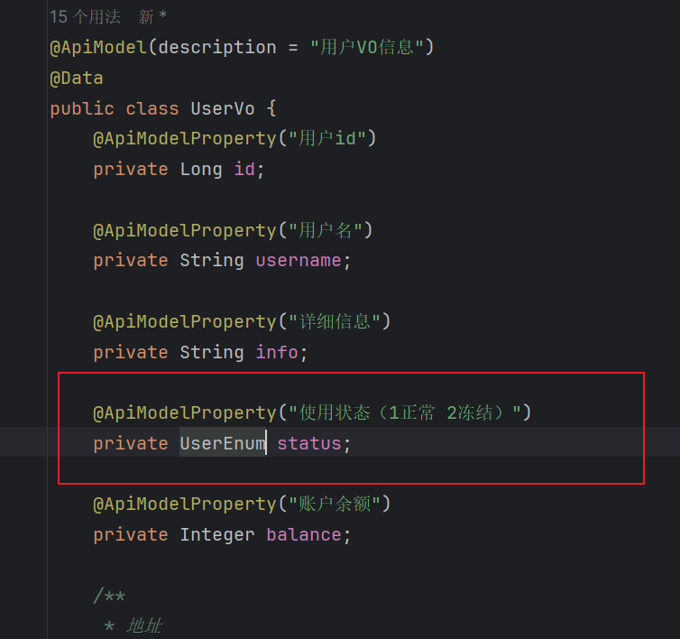

测试


由于json处理器默认将枚举展示名字，我们可以使用@Json注解指定展示

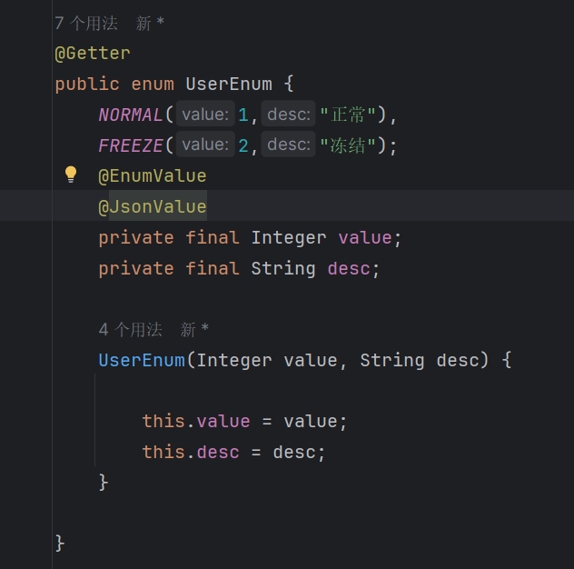


### Json处理器

我们数据库有json属性

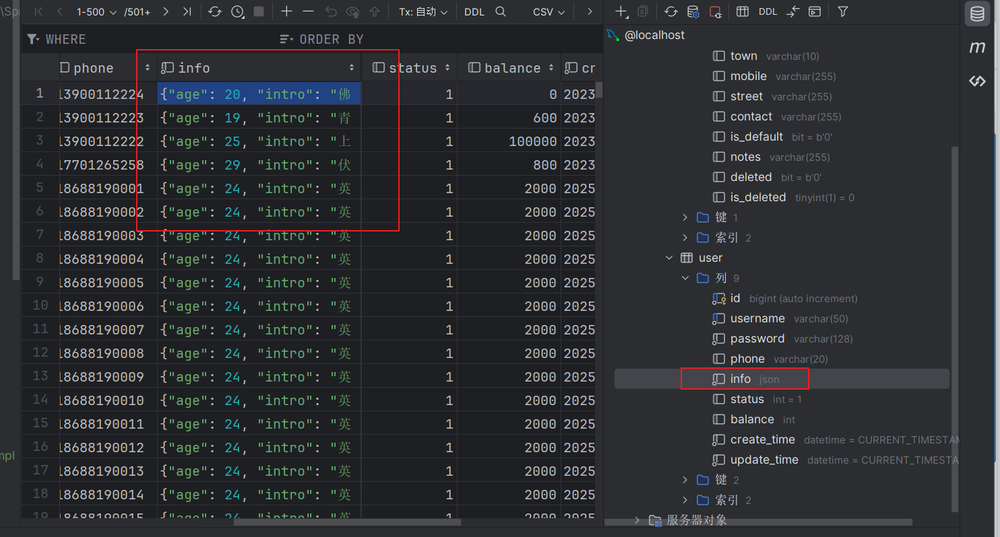

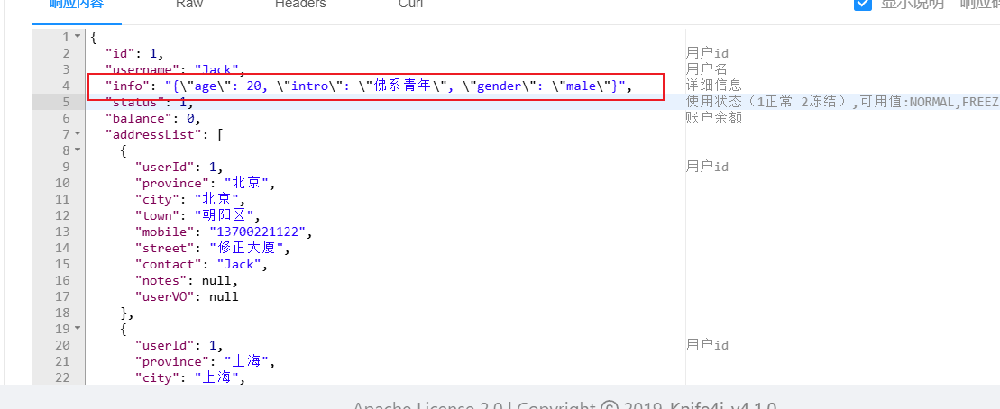

对json处理比较麻烦，把他转化成对象

```java
@Data
public class UserInfo {
    private int age;
    private String intro;
    private String gender;
}

```

修改po 以及vo

在pojo上添加注解 @TableField(typeHandler = JacksonTypeHandler.class) 并且开启自动映射@TableName(autoResultMap = true)

```java
@Data
@TableName(autoResultMap = true)
public class User {

    /**
     * 用户id
     */
    private Long id;

    /**
     * 用户名
     */
    private String username;

    /**
     * 密码
     */
    private String password;

    /**
     * 注册手机号
     */
    private String phone;

    /**
     * 详细信息
     */
//    private String info;

    /**
     * 详细信息
     */

    @TableField(typeHandler = JacksonTypeHandler.class)
    private UserInfo info;


    /**
     * 使用状态（1正常 2冻结）
     */
    private UserEnum status;

    /**
     * 账户余额
     */
    private Integer balance;

    /**
     * 创建时间
     */
    private LocalDateTime createTime;

    /**
     * 更新时间
     */
    private LocalDateTime updateTime;
}
```

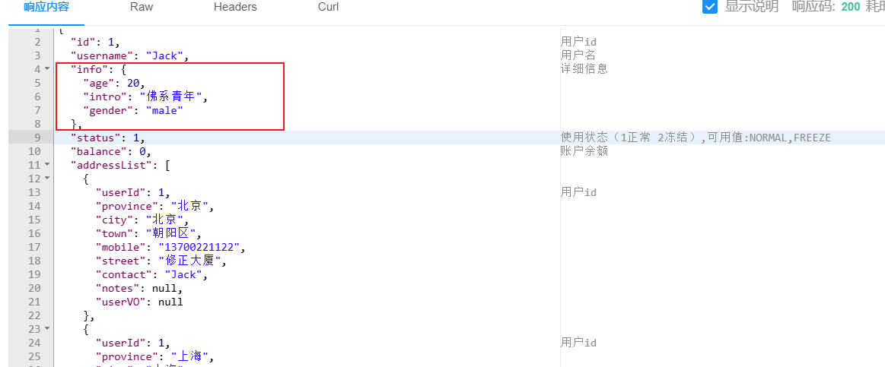

## 插件功能

### 分页插件

分页插件

1. 配置插件

   ```java
   @Configuration
   public class Mpconfig {
   
       /**
        * 添加分页插件
        */
       @Bean
       public MybatisPlusInterceptor mybatisPlusInterceptor() {
           MybatisPlusInterceptor interceptor = new MybatisPlusInterceptor();
           interceptor.addInnerInterceptor(new PaginationInnerInterceptor(DbType.MYSQL)); // 如果配置多个插件, 切记分页最后添加
           // 如果有多数据源可以不配具体类型, 否则都建议配上具体的 DbType
           return interceptor;
       }
       
   }
   ```

2. mp3.5.9及以上要单独引入依赖 [分页插件 | MyBatis-Plus](https://baomidou.com/plugins/pagination/)

3. 测试

   ```java
    /**
        *分页查询你
        */
       @Test
       void testPageQuery() {
           int pageNo = 1;
           int pageSize = 10;
           // 构造分页对象
           Page<User> page = Page.of(pageNo, pageSize);
           // 排序参数, 通过OrderItem来指定 构造排序
           page.addOrder(OrderItem.asc("balance"));
   
           page = userService.page(page);
           //获取总条数
           long total = page.getTotal();
           System.out.println("total = " + total);
           //获取总页数
        long pages = page.getPages();
           System.out.println("pages = " + pages);
           //获取当前页码
           long size = page.getSize();
           System.out.println("size = " + size);
           //获取当前页数据
           long current = page.getCurrent();
           System.out.println("current = " + current);
           //获取分页数据
           List<User> records = page.getRecords();
           records.forEach(System.out::println);
   
       }
   ```
   
   

练习

| **参数** | **说明**                                                     |
| -------- | ------------------------------------------------------------ |
| 请求方式 | GET                                                          |
| 请求路径 | /users/page                                                  |
| 请求参数 | `{    "pageNo": 1,    "pageSize": 5,    "sortBy": "balance",    "isAsc": false,    "name": "o",    "status": 1 }` |
| 返回值   | `{    "total": 100006,    "pages": 50003,    "list": [        {            "id": 1685100878975279298,            "username": "user_9****",            "info": {                "age": 24,                "intro": "英文老师",                "gender": "female"            },            "status": "正常",            "balance": 2000        }    ] }` |
| 特殊说明 | 1. 如果排序字段为空，默认按照更新时间排序排序  2. 字段不为空，则按照排序字段排序 |

构造dto 和vo

由于分页查询的分页要求都是一样的我们定义通用的分页，其他需要分页查询的dto和vo 直接继承

```java
@ApiModel("分页通用")
@Data
public class PageDTO {
    private Long pageNo;
    private Long pageSize;
    private String sortBy;
    private Boolean isAsc;
}
```

```java
@ApiModel("分页通用VO")
@Data
public class PageVO <T> {
    private Long total;
    private Long pages;
    private List<T> data;
}
```


controller

```java
 @ApiOperation("根据复杂条分页件查询用户")
    @GetMapping("/pages")
    public PageVO<UserVo> queryPagesUserByMethod(UserQueryDTO  userQueryDTO) {
        
        return userService.queryPagesUserByMethod(userQueryDTO);

    }
```

service

```java
   PageVO<UserVo> queryPagesUserByMethod(UserQueryDTO userQueryDTO);
```

serviceImpl

```java
 /**
     * 分页查询
     *
     * @param
     * @return
     */
    @Override
    public PageVO<UserVo> queryPagesUserByMethod(UserQueryDTO userQueryDTO) {
        String username = userQueryDTO.getUsername();
        Integer status = userQueryDTO.getStatus();
        Long pageNo = userQueryDTO.getPageNo();
        Long pageSize = userQueryDTO.getPageSize();
        String sortBy = userQueryDTO.getSortBy();
        Boolean isAsc = userQueryDTO.getIsAsc();

        //构造分页
        Page<User> page = Page.of(pageNo, pageSize);
        //排序条件
        if (sortBy != null) {
            page.addOrder(new OrderItem().setColumn(sortBy).setAsc(isAsc));
        }else {
            //默认排序 降序
            page.addOrder(new OrderItem().setColumn("create_time").setAsc(false));
        }
        //构造查询条件
        page = lambdaQuery().like(username != null, User::getUsername, username)
                .eq(status != null, User::getStatus, status)
                .page(page);


        //获取所需结果
        List<User> records = page.getRecords();

        Long total = page.getTotal();
        Long pages = page.getPages();

        //封装结果
        List<UserVo> userVos = BeanUtil.copyToList(records, UserVo.class);
        PageVO<UserVo> userVoPageVO = new PageVO<>();
        userVoPageVO.setTotal(total);
        userVoPageVO.setPages(pages);
        userVoPageVO.setData(userVos);
        return userVoPageVO;
    }
```


